<div align="center">


# 🎤 InterviewIQ

### *"Crack Every Interview."*

**India's #1 Free AI Mock Interview Platform — Practice with voice, get scored by AI, land your dream job**


<br/>

[](https://interviewiq64.vercel.app)
[](https://github.com/PrashantSinghUP64)
[](https://www.linkedin.com/in/prashant-kumar-singh-51b225230/)

<br/>


<br/>


</div>


---

## 📌 Table of Contents

- [🎤 About the Project](#-about-the-project)
- [🔑 Try It Live](#-try-it-live)
- [🔥 The Problem I Solved](#-the-problem-i-solved)
- [✨ Features (23+)](#-features-23)
- [📸 Screenshots](#-screenshots)
- [🏗️ Architecture & Tech Stack](#️-architecture--tech-stack)
- [🧠 Key Technical Challenges Solved](#-key-technical-challenges-solved)
- [⚙️ Installation & Setup](#️-installation--setup)
- [🌐 Deployment](#-deployment)
- [💡 What Makes It Unique](#-what-makes-it-unique)
- [🗺️ Roadmap](#️-roadmap)
- [👤 About the Creator](#-about-the-creator)
- [📄 License](#-license)

---

## 🎤 About the Project

**InterviewIQ** is a full-stack, AI-powered mock interview platform built for engineering students who want to practice interviews the smart way — with real-time voice recording, webcam attention tracking, AI-scored answers, and company-specific prep.

Most students read articles or ask friends to practice. **InterviewIQ simulates the real thing** — live webcam, speech-to-text, per-answer AI scoring (Clarity / Relevance / Depth), filler word detection, eye contact tracking, and downloadable report cards.

> *"I built InterviewIQ because mock interviews shouldn't just be 'read this question, write an answer'. They should feel real — with a camera on, a mic recording, and honest AI feedback after every answer."*
> — Prashant Kumar Singh, Creator

---

## 🔑 Try It Live

> No setup needed — open and start practicing in 30 seconds!

| | |
|---|---|
| 🔗 **Live URL** | [https://interviewiq64.vercel.app](https://interviewiq64.vercel.app) |
| 📧 **Login** | Google / GitHub / LinkedIn OAuth — powered by Clerk (one click) |
| ⚡ **Quick Test** | Click **"New Interview"** → Select role + difficulty → Enable camera → Get AI feedback instantly |

---

## 🔥 The Problem I Solved

| Before InterviewIQ ❌ | With InterviewIQ ✅ |
|---|---|
| No real interview simulation — just reading Q&A | Live webcam + speech-to-text — feels like the real thing |
| No way to know if your answer was actually good | Per-answer AI scoring: Clarity, Relevance, Depth (0–10 each) |
| No feedback on how confidently you spoke | Confidence Score with filler word detection (11 fillers tracked) |
| No eye contact or attention tracking | Canvas-based attention score sampled every 3 seconds |
| No company-specific interview intelligence | Groq AI generates process + culture insights (FAANG + Indian Unicorns) |
| No behavioral interview preparation method | STAR Story Builder — dump raw story, get STAR format instantly |
| Improvement impossible to track over time | Skill Radar + Progress Over Time charts — see growth session by session |
| No structured debrief after a real interview | Real Interview Debrief — paste questions, get a Groq AI prep plan |

---

## ✨ Features (23+)

### 🔐 Authentication
| Feature | Description |
|---|---|
| **Clerk Auth** | Google, GitHub, LinkedIn OAuth + email — production-grade, zero setup |
| **Protected Routes** | `clerkMiddleware` guards all `/dashboard/**` — unauthenticated users auto-redirected |
| **Custom Sign-In Page** | Split-screen: dark feature showcase sidebar on left, Clerk form on right |

### 🤖 AI Mock Interview (Core Feature)
| Feature | Description |
|---|---|
| **2-Step Setup Modal** | Step 1: Job Role + Company + Round type · Step 2: Tech Stack + Experience + Difficulty |
| **Difficulty Selector** | Easy / Medium / Hard — Gemini tailors question complexity to your chosen level |
| **Gemini Question Generation** | 5 unique questions per session — role, stack, and difficulty aware, no two sessions alike |
| **Interview Pre-Check** | Review session details, grant camera + mic access before going live |

### 📸 Webcam & Face Detection
| Feature | Description |
|---|---|
| **Webcam Integration** | HTML5 `getUserMedia`, mirror effect, "LIVE" badge, Disable/Enable toggle |
| **Face Not Detected Warning** | Red blur overlay + toast — "Face not detected — stay in frame" |
| **Privacy First** | Video is never recorded or stored — only attention scores saved to DB |

### 👁️ Attention Score (Canvas-Based)
| Feature | Description |
|---|---|
| **Canvas Sampling** | 64×64 pixel sample every 3 seconds during recording |
| **Skin-tone Heuristic** | Detects presence in center 40% of frame via reddish pixel analysis |
| **Smart Scoring** | `attentionScore = present_cycles / total_cycles × 100` saved per answer |
| **Edge Case Handled** | Zero detection cycles (too-short recording) → Score = 0%, no false positives |

### 🗣️ Confidence Score (Filler Word Analysis)
| Feature | Description |
|---|---|
| **11 Filler Words Tracked** | um, uh, like, basically, you know, sort of, kind of, right, okay so, actually, literally |
| **Multi-Factor Formula** | Filler penalty (3× weight) + length multiplier + speech rate check (60–220 WPM) |
| **Honest Range** | Capped 5%–99% — never falsely perfect or zero |
| **Visual Badges** | Each filler word shown with count — instant visibility into speaking habits |

### 🧠 Per-Answer AI Scoring (Gemini)
| Feature | Description |
|---|---|
| **3 Dimensions** | Clarity (0–10) · Relevance (0–10) · Depth (0–10) per answer with specific one-sentence feedback |
| **Animated Score Card** | Count-up animation while Gemini evaluates |
| **Skeleton Loading** | Smooth placeholder while AI processes |

### 📊 Interview Feedback & Report
| Feature | Description |
|---|---|
| **Circular SVG Progress Ring** | Overall rating (0–10) + Letter Grade (A/B/C/D) overlay badge |
| **4 Key Metrics Grid** | Clarity · Depth · Fluency % · Eye Contact % — all in one view |
| **Question Breakdown** | Collapsible per-question: score pills + Your Answer vs AI Model Answer |
| **Weak Areas Highlight** | Questions rated < 5 auto-flagged with improvement suggestions |
| **Download Report (PNG)** | `html2canvas` captures report card → downloads as `Interview_Report_[id].png` |

### ⭐ STAR Story Builder
| Feature | Description |
|---|---|
| **Story Bank** | All past STAR stories saved — your personal behavioral answer library |
| **Groq AI Reformat** | Dump raw story text → instantly rewritten into Situation / Task / Action / Result |

### 📋 Real Interview Debrief
| Feature | Description |
|---|---|
| **Log Real Questions** | Paste questions from an actual interview you attended |
| **Groq AI Prep Plan** | Company-specific 3-day study plan based on what you were actually asked |
| **History** | All past debriefs saved and accessible from dashboard |

### 🏢 Company Insights Explorer
| Feature | Description |
|---|---|
| **Categories** | Big Tech · WITCH · Unicorn · FinTech — filter tabs + search |
| **Groq AI Insights** | Interview rounds, process, culture per company on-demand |
| **Smart Caching** | Insights fetched once, cached in DB — no repeated API costs |

### 📈 Dashboard & Analytics
| Feature | Description |
|---|---|
| **Skill Radar Chart** | Spider chart: Clarity · Fluency · Relevance · Depth — see your skill shape |
| **Progress Over Time** | Line chart tracking score trend across all sessions |
| **Weak Area Detector** | Topics with consistently low scores flagged + Generate 3-Day Practice Plan |
| **Streak Tracker** | Daily practice streak with milestone badges (1 → 3 → 7 days) |
| **Tip of the Day** | New interview tip each day, date-seeded for consistency |

### 🎯 Bonus Tools
| Feature | Description |
|---|---|
| **HR Mock Round** | Behavioural & culture fit — dedicated soft-skill session |
| **Resume Interview** | Questions generated from your resume content |
| **Compare History** | Side-by-side improvement tracking across sessions |
| **AI Chat Widget** | Floating AI assistant on every page (bottom-right FAB) |
| **Dark / Light Mode** | `next-themes` with system preference — polished in both |

---

## 📸 Screenshots

### 🌑 Landing Page — Dark Mode
> *"India's #1 Free AI Mock Interview Platform · Powered by Gemini AI · 500+ Interview Topics · No Credit Card Required"*

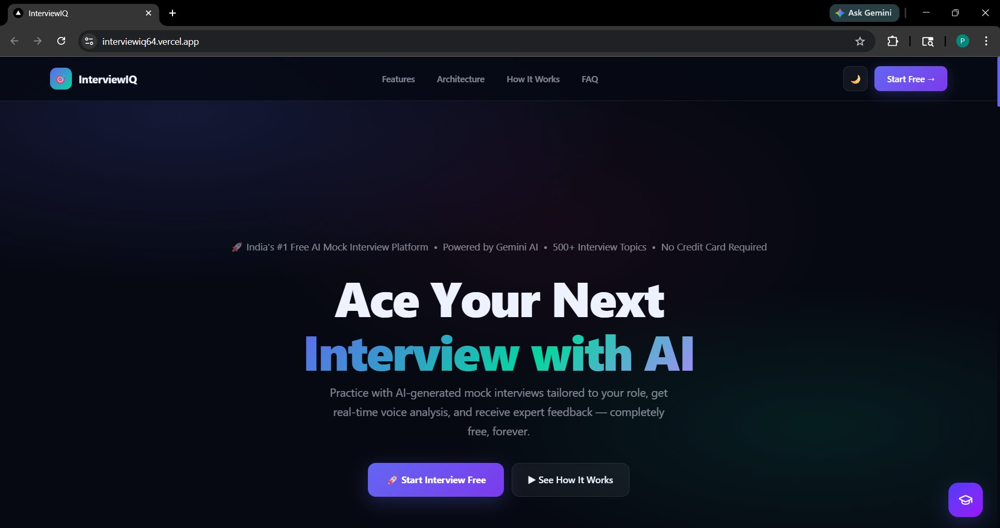

Bold dark-themed hero — **"Ace Your Next Interview with AI"** — gradient glow background, clean nav with theme toggle.
Two CTAs: **🚀 Start Interview Free** (primary, purple) + **▶ See How It Works** (secondary).

---

### ☀️ Landing Page — Light Mode
> Same powerful hero, fully responsive light theme

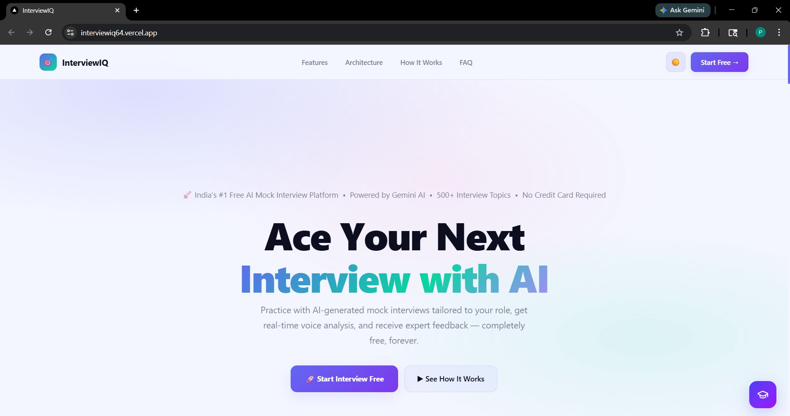

Soft gradient background — identical layout, optimized for light mode users. Dark/light toggle in top navbar switches instantly.

---

### ⚡ Features Grid — 6 Core Capabilities
> Each card explains one key feature at a glance — instantly scannable for any visitor

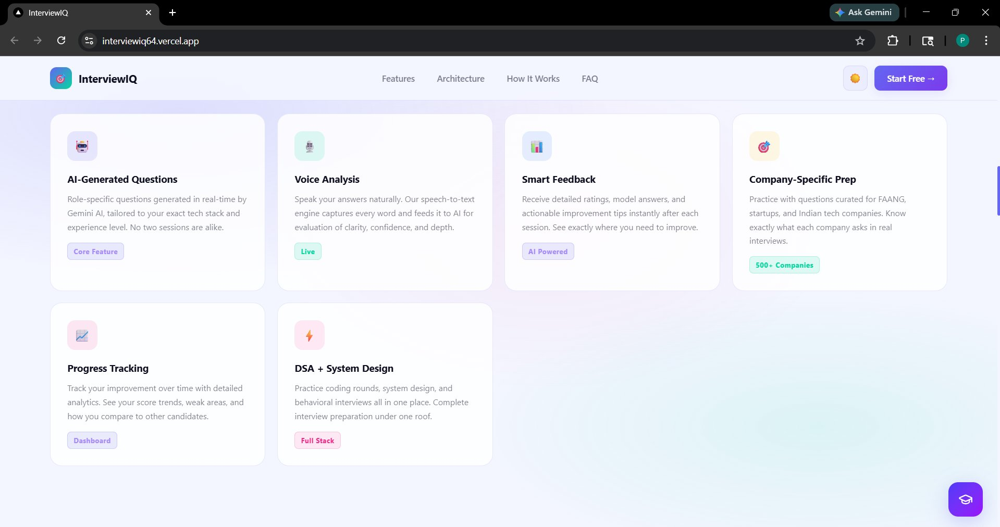

| Feature Card | Tag | What It Does |
|---|---|---|
| 🤖 AI-Generated Questions | `Core Feature` | Role + stack-specific questions by Gemini AI in real-time — no two sessions alike |
| 🎙️ Voice Analysis | `Live` | Speech-to-text feeds every spoken word to AI for evaluation |
| 📊 Smart Feedback | `AI Powered` | Detailed per-answer ratings + model answers after each session |
| 🏢 Company-Specific Prep | `500+ Companies` | FAANG, startups, Indian tech — questions tailored to real interview patterns |
| 📈 Progress Tracking | `Dashboard` | Score trends, weak area detection, session-by-session improvement |
| ⚡ DSA + System Design | `Full Stack` | Coding rounds + system design + behavioral — complete prep under one roof |

---

### 🎯 CTA Section — Ready to Land Your Dream Job?
> Conversion-focused bottom section with social proof and dual CTA

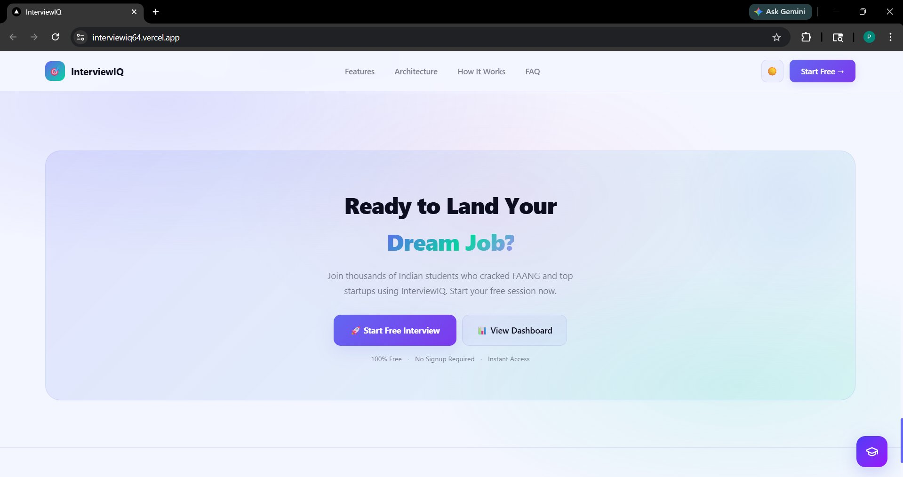

*"Join thousands of Indian students who cracked FAANG and top startups using InterviewIQ."*
**🚀 Start Free Interview** (primary) + **📊 View Dashboard** (secondary).
Trust signals below: **100% Free · No Signup Required · Instant Access**

---

### 🔐 Sign-In Page — Production-Grade Auth
> Split-screen: dark feature sidebar (left) + clean Clerk form (right)

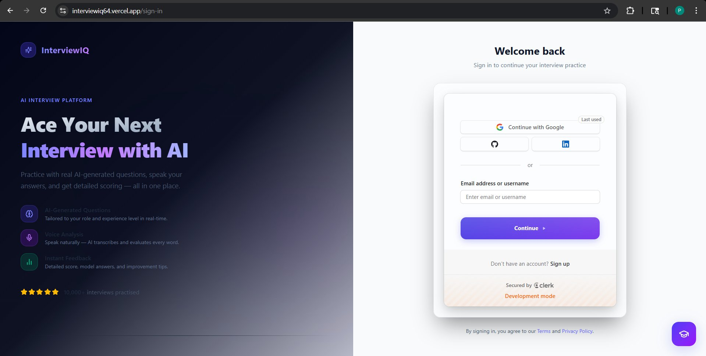

- **Left panel**: "Ace Your Next **Interview with AI**" — feature list (AI Questions · Voice Analysis · Instant Feedback) + ⭐⭐⭐⭐⭐ 10,000+ interviews practised
- **Right panel**: **Continue with Google / GitHub / LinkedIn** + Email login — "Secured by Clerk"

---

### 🖥️ Dashboard — Smart Analytics (Dark Mode)
> Everything at a glance — score, sessions, radar, progress, daily tip

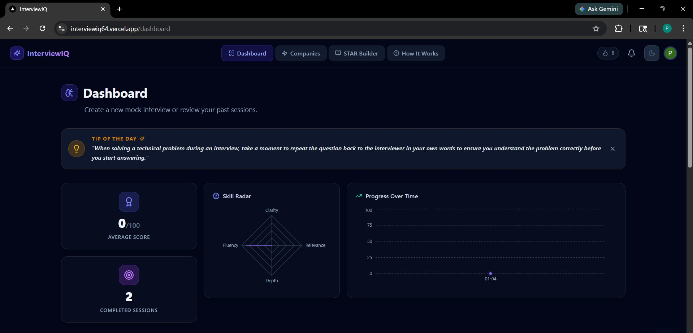

- **Tip of the Day** banner — fresh insight every session
- **Average Score** (0–100) + **Completed Sessions** counter (left column)
- **Skill Radar** — spider chart: Clarity / Fluency / Relevance / Depth (center)
- **Progress Over Time** — line chart tracking score history (right)

---

### 🔥 Weak Areas + Action Center
> Intelligent detection of struggling topics — with a one-click AI recovery plan

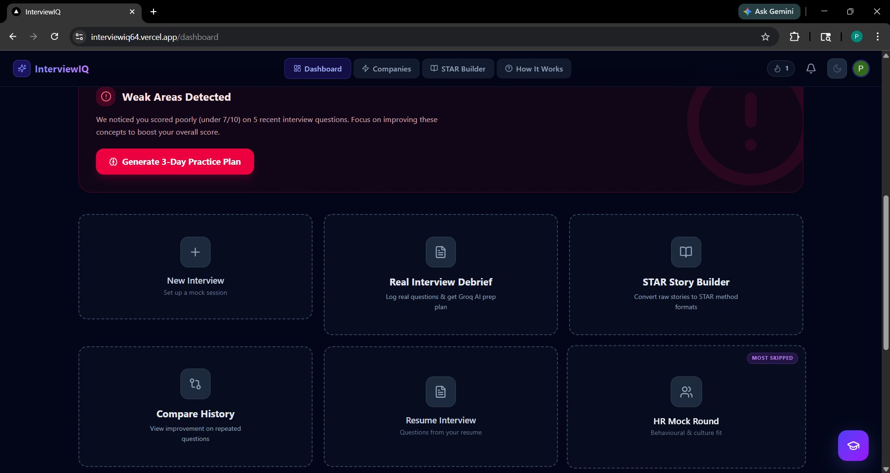

- 🔴 Red alert: *"Weak Areas Detected — scored poorly (under 7/10) on 5 recent questions"*
- **Generate 3-Day Practice Plan** button (Groq AI creates focused study plan)
- Quick-access tool grid:

| Tool | Purpose |
|---|---|
| ➕ New Interview | Set up a fresh mock session |
| 📄 Real Interview Debrief | Log real questions + get Groq AI prep plan |
| 📖 STAR Story Builder | Convert raw stories to STAR method format |
| 🔄 Compare History | View improvement on repeated questions |
| 📝 Resume Interview | Questions generated from your resume |
| 👥 HR Mock Round | Behavioural & culture fit *(tagged "Most Skipped")* |

---

### 📋 Previous Sessions + Debrief History
> Full session history with Feedback and Retry — past debrief analyses below

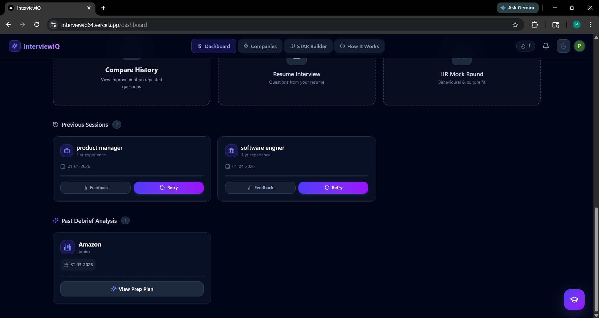

- **Previous Sessions**: product manager (1yr · 01-04-2026) | software engineer (1yr · 01-04-2026)
  Each card has **📊 Feedback** + **🔄 Retry** buttons
- **Past Debrief Analysis**: Amazon — junior level — 31-03-2026 → **✨ View Prep Plan**

---

### 🆕 New Interview Setup — Step 1: Job Role
> 2-step modal — focused, minimal, fast

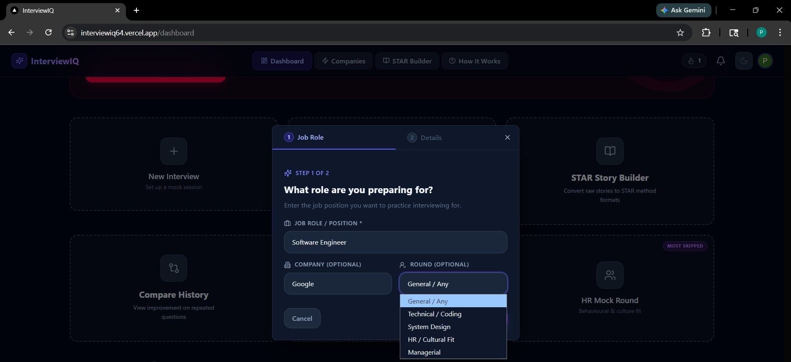

**STEP 1 OF 2** — "What role are you preparing for?"
- Job Role / Position (e.g. Software Engineer)
- Company (Optional): Google, Amazon, Flipkart, etc.
- Interview Round: **General / Any · Technical / Coding · System Design · HR / Cultural Fit · Managerial**

---

### 🆕 New Interview Setup — Step 2: Details
> AI tailors questions to your exact tech stack, experience, and difficulty level

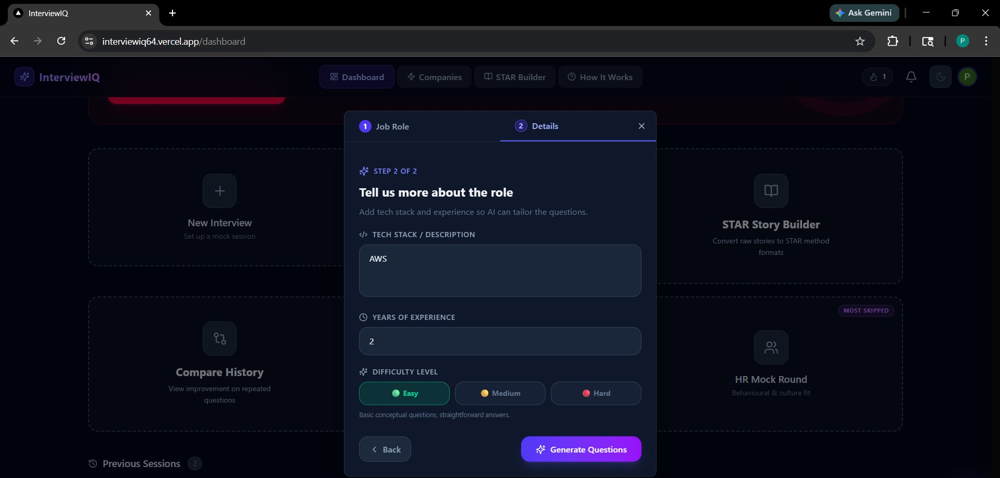

**STEP 2 OF 2** — "Tell us more about the role"
- Tech Stack / Description (e.g. AWS, React, Node.js)
- Years of Experience
- Difficulty: **🟢 Easy** (conceptual) · **🟡 Medium** (applied) · **🔴 Hard** (deep/advanced)
- **✨ Generate Questions** → Gemini creates 5 tailored questions instantly

---

### 🎙️ Interview Pre-Check — Camera & Mic Setup
> Review session details, grant permissions, then go live

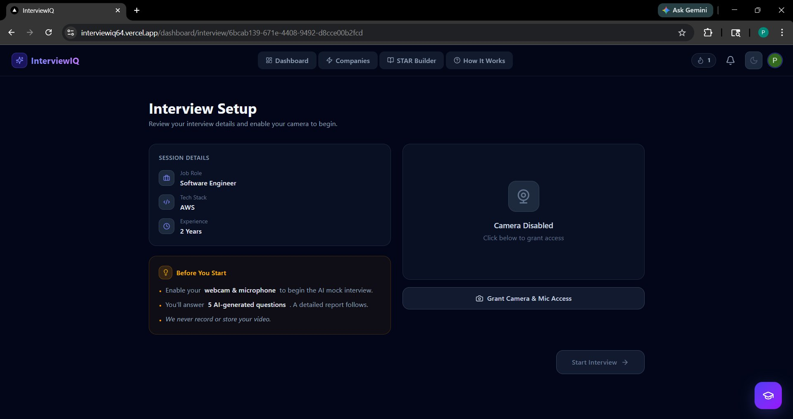

- **Session Details**: Job Role: Software Engineer · Tech Stack: AWS · Experience: 2 Years
- Right panel: Camera preview + **Grant Camera & Mic Access** button
- ⚠️ *"We never record or store your video"* — privacy assurance shown upfront
- **Start Interview →** button (enabled after camera access granted)

---

### 📡 Live Recording Session — Real-Time Interview
> Question 1 of 5, webcam running, live transcript, face detection active

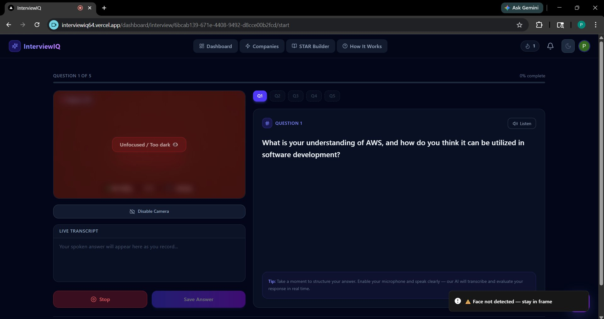

- Progress bar: **QUESTION 1 OF 5 — 0% complete** | Q1–Q5 navigation pills
- **Left (Webcam panel)**: Mirror view + *"Unfocused / Too dark"* attention warning + *"Face not detected — stay in frame"* toast notification
- **Right (Question panel)**: Full AI-generated question + 🔊 Listen button + interview tip at bottom
- Controls: **⏹ Stop** (red) · **Save Answer** (purple)
- **Live Transcript** area: spoken words appear in real-time as you answer

---

### 🏆 Streak Tracker — Daily Practice Habit
> Gamified streak system with milestone badges and progress bar

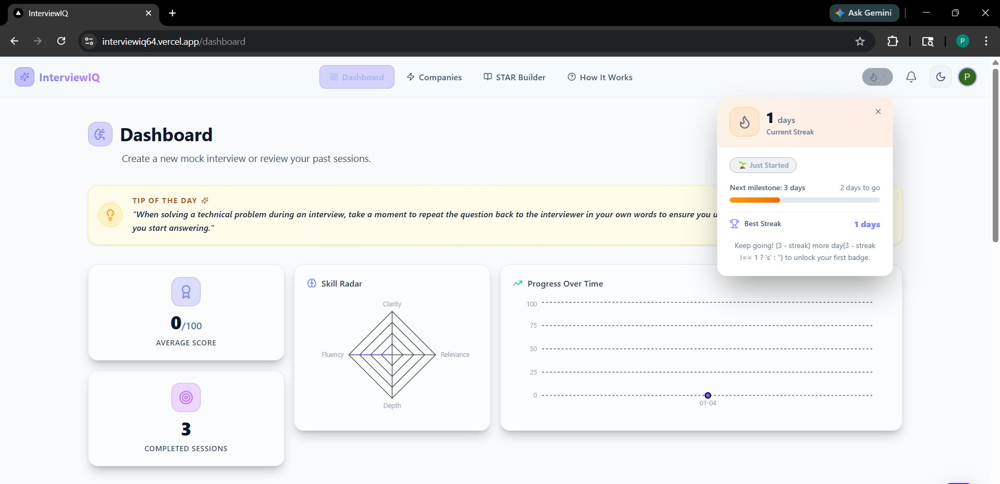

- **1 day Current Streak** — "Just Started" badge
- Next milestone: 3 days — 2 days to go (orange progress bar)
- **Best Streak**: 1 day
- Milestone message: unlock first badge at 3 days
- Light mode version shown — looks equally clean in dark mode

---

### ⭐ STAR Answer Builder
> Drop your messy raw stories — Groq AI rewrites into perfect STAR format instantly

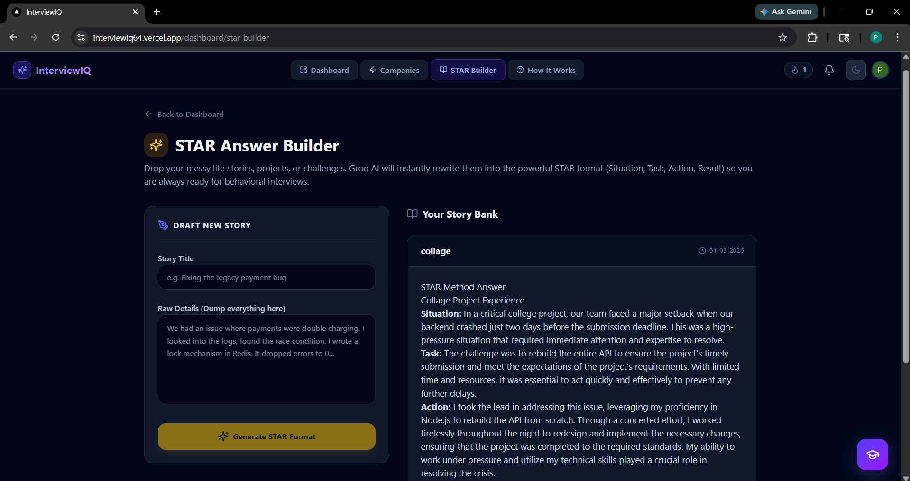

- **Left panel (Draft)**: Story Title input + Raw Details textarea + **✨ Generate STAR Format** button
- **Right panel (Story Bank)**: Past story — *"collage"* (31-03-2026) showing full STAR breakdown:
  - **Situation**: Backend crashed 2 days before deadline
  - **Task**: Rebuild entire API under time pressure
  - **Action**: Led rebuild with Node.js, worked through the night
  - **Result**: Project submitted on time, requirements met

---

### 🏢 Company Insights Explorer
> FAANG + WITCH + Indian Unicorns — filter, search, get AI interview intelligence

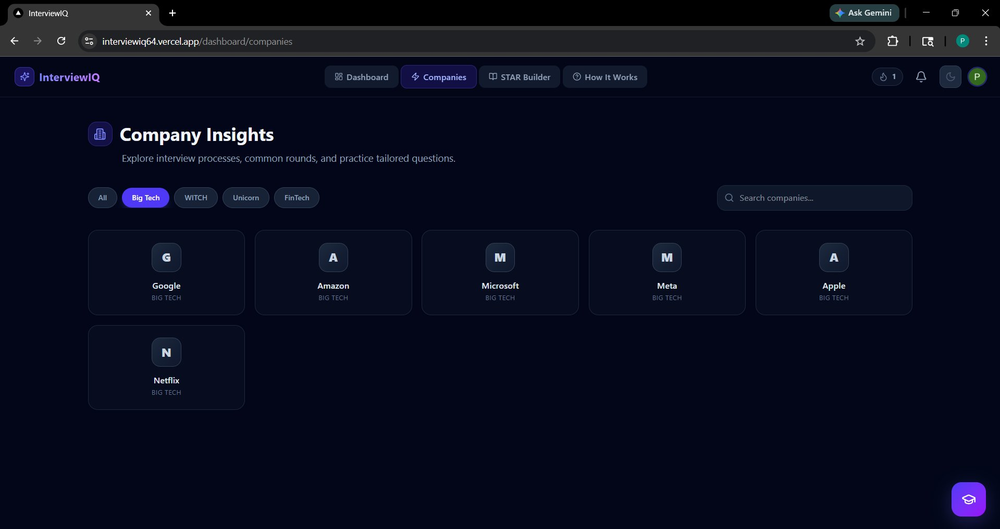

- Filter tabs: **All · Big Tech · WITCH · Unicorn · FinTech**
- Search bar: "Search companies..."
- Company grid: Google · Amazon · Microsoft · Meta · Apple · Netflix (Big Tech shown)
- Click any company → Groq AI fetches interview process, round structure, culture insights
- **Smart cache**: insight fetched once, stored in DB, returned instantly on all future visits

---

## 🏗️ Architecture & Tech Stack

```
┌──────────────────────────────────────────────────────────────────┐
│                          FRONTEND                                │
│         Next.js 15 (App Router) + TypeScript + Tailwind v4      │
│              Framer Motion + shadcn/ui + Recharts                │
│                        Deployed on Vercel                        │
│                                                                  │
│  ┌──────────┐ ┌──────────┐ ┌──────────┐ ┌──────────────────┐   │
│  │Dashboard │ │Interview │ │  STAR    │ │Companies/Debrief │   │
│  │Metrics   │ │  Session │ │ Builder  │ │   Explorer       │   │
│  └──────────┘ └──────────┘ └──────────┘ └──────────────────┘   │
└────────────────────────┬─────────────────────────────────────────┘
                         │ Next.js API Routes + Server Actions
┌────────────────────────▼─────────────────────────────────────────┐
│                    BACKEND (API Layer)                           │
│         Next.js Server Actions + Route Handlers                  │
│                                                                  │
│  ┌───────────────┐  ┌──────────────┐  ┌──────────────────────┐  │
│  │  Gemini API   │  │   Groq API   │  │   Drizzle ORM        │  │
│  │  Questions    │  │   Debrief    │  │   Type-safe Queries  │  │
│  │  Scoring      │  │   STAR       │  │   Schema Migrations  │  │
│  │  Model Ans.   │  │   Companies  │  │                      │  │
│  └───────────────┘  └──────────────┘  └──────────────────────┘  │
└────────┬──────────────────┬────────────────────────────┬─────────┘
         │                  │                            │
┌────────▼──────┐  ┌────────▼────────┐  ┌───────────────▼──────────┐
│     Neon      │  │     Clerk       │  │    Browser APIs          │
│  PostgreSQL   │  │  Authentication │  │  Web Speech API (STT)    │
│  (Drizzle     │  │  Google OAuth   │  │  MediaDevices (Camera)   │
│   ORM)        │  │  GitHub OAuth   │  │  Canvas (Attention)      │
│  5 Tables     │  │  LinkedIn OAuth │  │  html2canvas (Report)    │
│               │  │  Session Mgmt   │  │  face-api.js (Detection) │
└───────────────┘  └─────────────────┘  └──────────────────────────┘
```

### Tech Stack — Why Each Choice

| Layer | Technology | Why This Choice |
|---|---|---|
| **Framework** | Next.js 15 (App Router) | SSR + client components in one repo — no separate backend needed |
| **Language** | TypeScript 5.8 | Full type safety from DB schema → API response → UI state — catches bugs at compile time |
| **Styling** | Tailwind CSS v4 + Framer Motion | Utility-first rapid UI + smooth animations for score reveals and count-ups |
| **Auth** | Clerk | Pre-built OAuth (Google/GitHub/LinkedIn), middleware, session management — zero auth bugs |
| **Database** | Neon (serverless PostgreSQL) | Serverless-native, no cold start on DB, free tier scales naturally |
| **ORM** | Drizzle ORM | Schema-as-code, fully type-safe queries, `db:push` for fast iteration |
| **Primary AI** | Google Gemini | Best-in-class long-context for question generation + nuanced per-answer evaluation |
| **Secondary AI** | Groq | Ultra-fast inference (5–10× faster) for real-time STAR reformat and company debrief |
| **Deploy** | Vercel | Zero-config Next.js, edge network, instant CI/CD from every GitHub push |

---

## 🧠 Key Technical Challenges Solved

> Real problems debugged and solved during development — not just theory.

| Challenge | Root Cause | Solution |
|---|---|---|
| **Attention score always 0%** even with face clearly visible | Detection loop completing 0 cycles for very short recordings — silent division by zero | Added `totalCycles === 0` guard → explicit 0% with clear UI warning, no false calculation |
| **Confidence score returning 100% or 0%** for valid answers | Formula not clamped — very short or filler-heavy answers broke the range silently | Hard-clamped result to 5%–99% + WPM range check (< 60 or > 220 WPM triggers −20% penalty) |
| **Gemini returning malformed JSON** for question generation | No strict output schema in prompt — model added markdown fences and explanation text around JSON | Added "respond ONLY with JSON, no markdown" in system prompt + `JSON.parse()` in try-catch with re-prompt fallback |
| **Speech-to-text stopping mid-answer** on long responses | `webkitSpeechRecognition` auto-stops after silence (browser default timeout) | Set `continuous = true` + `interimResults = true` + re-trigger `start()` on `onend` event while recording flag is active |
| **Webcam stream not releasing** — camera LED stays on after session | `getUserMedia` stream tracks not stopped on React component unmount | `useEffect` cleanup: `stream.getTracks().forEach(track => track.stop())` — camera releases cleanly every time |
| **Groq company insights re-fetched on every page visit** — API costs accumulating | No caching layer — every visit to a company card triggered a fresh Groq API call | Added `processJson` column in `topCompany` DB table — fetch once, cache permanently, return cached on all future visits |
| **Drizzle schema changes not reflecting in Neon DB** during development | Adding new columns without running `db:push` — schema drift between code and DB | Added `npm run db:push` as mandatory pre-dev step in README; added schema version comments in `schema.js` |
| **Clerk middleware blocking app API routes** | `clerkMiddleware` was protecting `/api/**` routes by default — app calls were failing silently | Added explicit public route matcher — only `/dashboard/**` and auth pages guarded; API routes marked public |

---

## ⚙️ Installation & Setup

### Prerequisites
```
Node.js >= 18.x
npm >= 9.x
Neon PostgreSQL account — free tier works perfectly
Clerk account — free tier works perfectly
Google Gemini API key — free tier (1M tokens/month)
Groq API key — free tier (ultra-fast inference)
```

### 1. Clone
```bash
git clone https://github.com/PrashantSinghUP64/InterviewIQ.git
cd InterviewIQ
```

### 2. Install Dependencies
```bash
npm install
```

### 3. Environment Variables

Create `.env.local` in project root:

```env
# Google Gemini AI
NEXT_PUBLIC_GEMINI_API_KEY=your_gemini_api_key

# Clerk Authentication
NEXT_PUBLIC_CLERK_PUBLISHABLE_KEY=your_clerk_publishable_key
CLERK_SECRET_KEY=your_clerk_secret_key
NEXT_PUBLIC_CLERK_SIGN_IN_URL=/sign-in
NEXT_PUBLIC_CLERK_SIGN_UP_URL=/sign-up

# Neon PostgreSQL (via Drizzle ORM)
NEXT_PUBLIC_DRIZZLE_DB_URL=your_neon_connection_string

# Groq AI
GROQ_API_KEY=your_groq_api_key
```

### 4. Setup Database
```bash
# Push Drizzle schema to Neon DB — run this before first launch
npm run db:push

# Optional: Open Drizzle Studio to visually browse your DB
npm run db:studio
```

### 5. Run
```bash
npm run dev
```

| Service | URL |
|---|---|
| App | `http://localhost:3000` |
| Drizzle Studio | `http://localhost:4983` |

---

## 🌐 Deployment

| Service | Platform | Status |
|---|---|---|
| Full App (Frontend + API Routes) | Vercel | ✅ Live |
| Database | Neon PostgreSQL | ✅ Live |
| Authentication | Clerk | ✅ Live |
| AI — Question Generation & Scoring | Google Gemini (Free Tier) | ✅ Live |
| AI — Debrief, STAR & Company Insights | Groq (Free Tier) | ✅ Live |

🔗 **Live App:** [https://interviewiq64.vercel.app](https://interviewiq64.vercel.app)

---

## 💡 What Makes It Unique

| Feature | InterviewIQ | Exponent | Interviewing.io | LeetCode |
|---|---|---|---|---|
| Solo AI mock — no scheduling, no peer needed | ✅ | ❌ Structured courses | ❌ Peer-based | ❌ |
| Real-time speech-to-text recording | ✅ | ❌ | ❌ | ❌ |
| Attention / Eye contact score | ✅ | ❌ | ❌ | ❌ |
| Confidence + Filler word analysis | ✅ | ❌ | ❌ | ❌ |
| Per-answer Clarity / Relevance / Depth scoring | ✅ | ❌ | ❌ | ❌ |
| STAR Story Builder (Groq AI) | ✅ | ❌ | ❌ | ❌ |
| Real interview debrief + AI prep plan | ✅ | ❌ | ❌ | ❌ |
| Company-specific insights (FAANG + Indian) | ✅ | Partial | Partial | ❌ |
| Downloadable report card (PNG) | ✅ | ❌ | ❌ | ❌ |
| Skill Radar + Progress Over Time charts | ✅ | ❌ | ❌ | ❌ |
| 100% Free — no credit card, no limit | ✅ | ❌ Paid | ❌ Paid | Partial |

---

## 🗺️ Roadmap

- [x] Clerk Auth — Google, GitHub, LinkedIn OAuth
- [x] Gemini question generation (role + stack + difficulty aware)
- [x] 2-step interview setup modal with difficulty selector
- [x] Live webcam + speech-to-text recording session
- [x] Canvas-based attention / eye contact scoring
- [x] Confidence score with filler word detection + WPM check
- [x] Per-answer AI scoring — Clarity / Relevance / Depth
- [x] Full feedback report with letter grade + circular progress ring
- [x] Your Answer vs AI Model Answer side-by-side comparison
- [x] Downloadable PNG report card (html2canvas)
- [x] STAR Story Builder (Groq)
- [x] Real Interview Debrief Tool (Groq)
- [x] Top Companies Explorer with category filters + search
- [x] Skill Radar + Progress Over Time charts (Recharts)
- [x] Weak Area Detector + 3-Day Practice Plan
- [x] Streak Tracker with milestone badges
- [x] HR / Behavioral Interview Mode
- [x] Side-by-side Interview Comparison
- [x] Dark / Light Mode with system preference
- [x] AI Chat Widget on all pages
- [ ] Resume upload → resume-based questions
- [ ] Audio playback of recorded answers
- [ ] Video export of full interview session
- [ ] Mobile app (React Native)
- [ ] Email report delivery post-session
- [ ] College-specific placement round patterns
- [ ] Premium tier — unlimited AI sessions

---

## 👤 About the Creator

<div align="center">

**Prashant Kumar Singh**
B.Tech CSE (AI/ML)

*"I built InterviewIQ because real interview practice shouldn't need another person. It should be available at 2am, give brutally honest feedback, and make you measurably better every single session."*

</div>

| Platform | Link |
|---|---|
| 💼 LinkedIn | [linkedin.com/in/prashant-kumar-singh-51b225230](https://www.linkedin.com/in/prashant-kumar-singh-51b225230/) |
| 🐙 GitHub | [github.com/PrashantSinghUP64](https://github.com/PrashantSinghUP64) |
| 🐦 Twitter / X | [x.com/prashant_UP_64](https://x.com/prashant_UP_64) |
| 📺 YouTube | [Technical Knowledge Hindi](https://www.youtube.com/@technicalknowledgehindi1949) |
| 🔗 All Links | [linktr.ee/Prashantsingh64](https://linktr.ee/Prashantsingh64) |
| 📧 Email | [ps7027804@gmail.com](mailto:ps7027804@gmail.com) |

---

## 🤝 Contributing

1. Fork the Project
2. Create Feature Branch (`git checkout -b feature/AmazingFeature`)
3. Commit Changes (`git commit -m 'feat: Add AmazingFeature'`)
4. Push (`git push origin feature/AmazingFeature`)
5. Open Pull Request

---

## 📄 License

```
MIT License — Copyright (c) 2024-2026 Prashant Kumar Singh
Attribution required. See LICENSE file for full details.
```

---

<div align="center">

**If this project helped you — drop a ⭐. It keeps me going.**

*Built from scratch by a student, for students.*
*Every line of code written with one goal — Practice smarter. Perform better. Get placed.*

**© 2024–2026 InterviewIQ | Prashant Kumar Singh | B.Tech CSE (AI/ML)**

</div>
